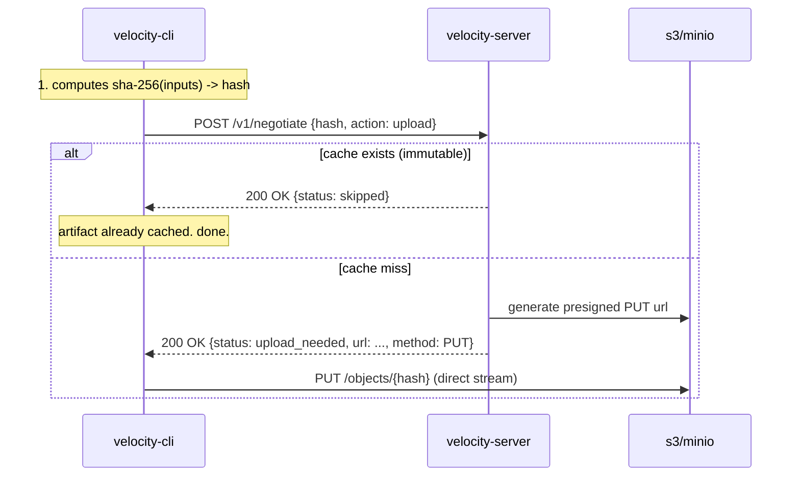

# VelocityCache

**v3.0.0 | self-hosted distributed build cache**

velocitycache is a high performance, stateless, and storage agnostic remote cache for monorepo build systems. designed for platform engineering teams who need the speed of a remote cache without the data sovereignty risks of a saas.

unlike vercel remote cache or turborepo, velocitycache is designed to run inside your private vpc. it has zero external dependencies (no postgres, no redis). it effectively turns your existing s3/minio buckets into a globally distributed, immutable build cache.

## the philosophy: "the network is the cache"

traditional build caches are stateful bottlenecks. they require a central server to ingest, process, and store artifacts. this scales poorly.

velocitycache adopts a "vending machine" architecture. the server is a lightweight control plane that never touches the heavy build artifacts. instead, it negotiates secure, direct streams between your build agents and your object storage.

  * **stateless**: no database to manage. configuration is 12-factor (env vars).
  * **storage agnostic**: pluggable drivers for s3, gcs, azure, and local disk.
  * **immutable**: implements a strict "first-write-wins" policy to prevent cache poisoning.

## architecture

the system consists of two components:

1.  **velocity-cli (agent)**: runs in your ci/local environment. handles graph hashing and process execution.
2.  **velocity-server (gateway)**: runs in your cluster. handles authentication and vends presigned urls.

<!-- end list -->



### the "vending machine" protocol

i moved away from standard http redirects (307) to an explicit negotiation protocol. standard http clients often fail to rewind streams on redirects, causing upload failures for large artifacts.

by using a 2-step negotiation (`/v1/negotiate` -\> `upload`), the client handles the orchestration logic, ensuring robust retries and correct method verbs.

## features

### 1\. content-addressable storage (cas)

cache keys are derived strictly from the `sha-256` hash of the task inputs (source files, environment variables, tool versions). this guarantees that `hash(a)` always points to the build output of `input(a)`. it is mathematically impossible to retrieve the wrong cache for a given input.

### 2\. immutability & security

velocitycache enforces a "first-write-wins" policy.

  * before vending a `PUT` url, the server checks if the key exists in s3.
  * if it exists, it denies the upload request.
  * this prevents **cache poisoning** attacks where a malicious actor overwrites a valid build artifact with a compromised binary.

### 3\. zstandard compression

all artifacts are compressed using `zstd` (level 1) before upload. `zstd` offers significantly higher decompression speeds compared to `gzip`, which is the critical metric for ci restore times.

### 4\. zero-trust capable

authentication is handled via a shared bearer token. the server is designed to sit behind an internal load balancer or mesh (mtls). presigned urls generated for s3 are cryptographically bound to the specific object key, preventing cross-tenant write attacks.

## installation

velocitycache is distributed as a single docker container.

### docker compose (quickstart)

spin up a full stack (server + minio + prometheus) locally:

```yaml
version: "3.8"
services:
  velocity:
    image: bit2swaz/velocity-server:latest
    ports:
      - "8080:8080"
    environment:
      VC_STORAGE_DRIVER: s3
      VC_S3_ENDPOINT: http://minio:9000
      VC_S3_BUCKET: velocity-cache
      VC_S3_REGION: us-east-1
      VC_AUTH_TOKEN: secret-token-123
      AWS_ACCESS_KEY_ID: minioadmin
      AWS_SECRET_ACCESS_KEY: minioadmin

  minio:
    image: minio/minio
    command: server /data
    ports:
      - "9000:9000"
```

### kubernetes

for production, deploy the server as a deployment and use an external s3 bucket.

```yaml
env:
  - name: VC_STORAGE_DRIVER
    value: "s3"
  - name: VC_S3_BUCKET
    value: "ci-build-cache-prod"
  - name: VC_AUTH_TOKEN
    valueFrom:
      secretKeyRef:
        name: velocity-secrets
        key: token
```

## configuration

configuration is strictly environment-variable based.

| variable | description | default |
| :--- | :--- | :--- |
| `VC_PORT` | port to listen on | `8080` |
| `VC_AUTH_TOKEN` | shared secret for bearer auth | (required) |
| `VC_STORAGE_DRIVER` | storage backend (`s3`, `local`, `gcs`) | `local` |
| `VC_S3_BUCKET` | bucket name | - |
| `VC_S3_REGION` | aws region | `us-east-1` |
| `VC_LOCAL_ROOT` | path for local driver storage | `./data` |

## api reference

the api is intended for the velocity cli, but is documented here for transparency.

### `POST /v1/negotiate`

negotiates an action (upload/download) for a specific hash.

**request:**

```json
{
  "hash": "8f4b2e...",
  "action": "upload"
}
```

**response (upload needed):**

```json
{
  "status": "upload_needed",
  "url": "https://s3.us-east-1.amazonaws.com/bucket/key?signature=..."
}
```

**response (upload skipped):**

```json
{
  "status": "skipped"
}
```

### `GET /health`

liveness probe endpoint. returns 200 ok.

## usage (cli)

in your monorepo root, create a `velocity.yml`:

```yaml
version: 1
remote:
  enabled: true
  url: "https://cache.internal.corp"
  token: "${CI_CACHE_TOKEN}"
pipeline:
  build:
    outputs: ["dist/**", ".next/**"]
    depends_on: ["^build"]
```

run the build:

```bash
# runs tasks in parallel, pushing/pulling from the remote cache
velocity run build
```

## observability

the server exposes prometheus metrics at `/metrics`.

  * `vc_cache_hits_total`: counter of successful cache lookups.
  * `vc_cache_misses_total`: counter of lookups requiring a build.
  * `vc_negotiation_latency`: histogram of api response times.

import the provided `grafana-dashboard.json` to visualize hit rates and bandwidth saved.

## license

mit license.