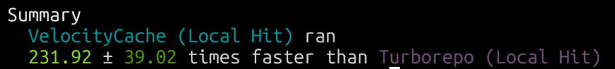
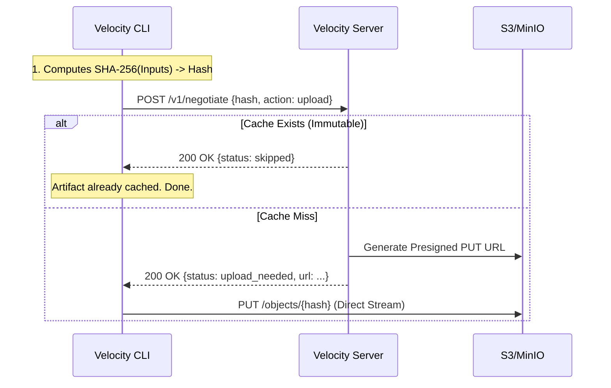

# VelocityCache v3.0


*velocitycache head to head against vercel's turborepo*

**stateless, self-hosted remote cache for high-performance monorepos.**

velocitycache is a distributed infrastructure component designed to accelerate ci/cd pipelines by caching build artifacts. unlike saas solutions, velocitycache is designed to be deployed inside your private vpc, ensuring **100% data sovereignty**, **zero external dependencies**, and **maximum speed**.

"the network is the cache."

---

### 💡 Why Presigned URLs?
traditional remote caches act as a proxy, forcing all build artifacts to pass through the server before reaching storage. this turns the server into a massive cpu and network bottleneck.

**velocitycache is different.** it uses the "vending machine" pattern:
1. the cli asks for permission.
2. the server returns a secure, temporary **presigned url** for s3.
3. the cli uploads/downloads directly to the cloud storage.

**the result:** you can saturate a 10gbps network connection uploading artifacts while your velocity server runs on a tiny $5/mo instance using <1% cpu.

---

## Architecture: The "Vending Machine" Pattern

velocitycache v3.0 abandons the traditional "proxy everything" model in favor of a high-performance "vending machine" pattern. the server acts as a lightweight traffic controller, while the heavy lifting of data transfer happens directly between the cli and your object storage.

### High-Level Data Flow

1.  **negotiation**: the velocity cli sends a hash of the inputs to the server.
2.  **vending**:
    *   **cache hit**: server confirms existence.
    *   **cache miss**: server generates a **presigned url** (s3/minio) and returns it to the cli.
3.  **transfer**: the cli streams the artifact directly to/from the object storage using the presigned url.

this architecture ensures the server is never a bandwidth bottleneck.



### Components

*   **velocity agent (cli)**: runs in ci/local. handles hashing, graph execution, and direct storage transfers.
*   **velocity gateway (server)**: stateless go server. handles authentication, generates tickets, and enforces security policies.
*   **storage backend**: s3, minio, gcs, or local disk (via proxy).

## Installation

### 1. The Local Cloud (Docker Compose)

the easiest way to spin up the entire stack (server + minio) for testing.

```yaml
version: '3.8'
services:
  minio:
    image: minio/minio
    command: server /data --console-address ":9001"
    environment:
      MINIO_ROOT_USER: admin
      MINIO_ROOT_PASSWORD: password
    ports:
      - "9000:9000"
      - "9001:9001"

  velocity:
    image: bit2swaz/velocity-server:v3
    environment:
      VC_PORT: 8080
      VC_AUTH_TOKEN: secret-token
      VC_STORAGE_DRIVER: s3
      VC_S3_ENDPOINT: http://minio:9000
      VC_S3_BUCKET: velocity-cache
      VC_S3_REGION: us-east-1
      AWS_ACCESS_KEY_ID: admin
      AWS_SECRET_ACCESS_KEY: password
      AWS_REGION: us-east-1
    ports:
      - "8080:8080"
    depends_on:
      - minio
```

### 2. Binary Installation

download the latest release for your platform.

```bash
# Server
./velocity-server

# CLI
./velocity-cli run build
```

### 3. NPM (Node.js)

for javascript/typescript projects, you can use `npx` to run the cli without global installation.

```bash
# initialize velocity in your project
npx velocity-cache@latest init

# run a build task
npx velocity-cache@latest run build
```

## Configuration

### Server Configuration (Environment Variables)

the server follows the 12-factor app methodology.

| variable | description | default |
| :--- | :--- | :--- |
| `VC_PORT` | port to listen on | `8080` |
| `VC_AUTH_TOKEN` | shared secret for bearer auth | - |
| `VC_STORAGE_DRIVER` | storage backend (`s3` or `local`) | `local` |
| `VC_S3_BUCKET` | bucket name (for s3 driver) | - |
| `VC_S3_REGION` | aws region (for s3 driver) | - |
| `VC_S3_ENDPOINT` | custom s3 endpoint (e.g. for minio) | - |
| `VC_LOCAL_ROOT` | directory path (for local driver) | - |
| `VC_BASE_URL` | public url of the server (for local driver) | `http://localhost:8080` |

### Client Configuration (`velocity.yml`)

velocitycache v3.0 uses a clean yaml configuration file in your project root.

```yaml
version: 1
remote:
  enabled: true
  url: "http://localhost:8080"
  token: "${VC_AUTH_TOKEN}" # Supports env var expansion

pipeline:
  build:
    command: "npm run build"
    inputs:
      - "src/**"
      - "package.json"
    outputs:
      - "dist/**"
    depends_on:
      - "^build" # Topological dependency
```

## Security: First Write Wins

velocitycache implements a strict **immutability policy** to prevent cache poisoning.

*   **rule**: once a cache key is written, it cannot be overwritten.
*   **mechanism**: during the `negotiate` phase, the server checks the storage driver. if the key exists, it returns `skipped`, and the cli will not attempt an upload.
*   **benefit**: guarantees that a specific input hash always resolves to the exact same artifact, regardless of race conditions in ci.

## Observability

the server exposes a `/metrics` endpoint compatible with prometheus.

*   `vc_cache_hits`: total cache hits.
*   `vc_cache_misses`: total cache misses.
*   `vc_negotiation_latency`: time taken to negotiate tickets.

## Future Roadmap

*   **v3.1**: batch negotiation (optimize for cold starts with 100+ tasks).
*   **v3.2**: cache eviction/ttl (lifecycle policies documentation).
*   **v4.0**: observability dashboard (grafana/prometheus integration).

---

*made with ❤️ by [bit2swaz](https://x.com/bit2swaz)*
